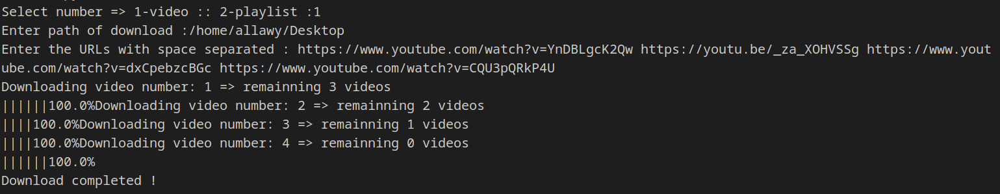

# التثبيت
## 1.python

اختر النسخة المناسبة لنظام التشغيل الخاص بك من [هنا](https://python.land/installing-python)

## 2.pytube

اكتب هذا الامر في ال Cmd  في  نظام التشغيل ويندوز او في ال terminal في نظام التشغيل linux 
```
$ pip install pytube
``` 

# التشغيل

اكتب هذا الامر في ال Cmd  في  نظام التشغيل ويندوز او في ال terminal في نظام التشغيل linux

```
$ python video_downloader.py
``` 

# المميزات

1.يمكن تحميل اكثر من فيديو وذلك باعطاء البرنامج اكثر من رابط بينهم مسافة في نفس الوقت 


2.يمكن تحميل playlist او أكثر وذلك بأعطاء البرنامج اكثر من رابط بينهم مسافة في نفس الوقت

